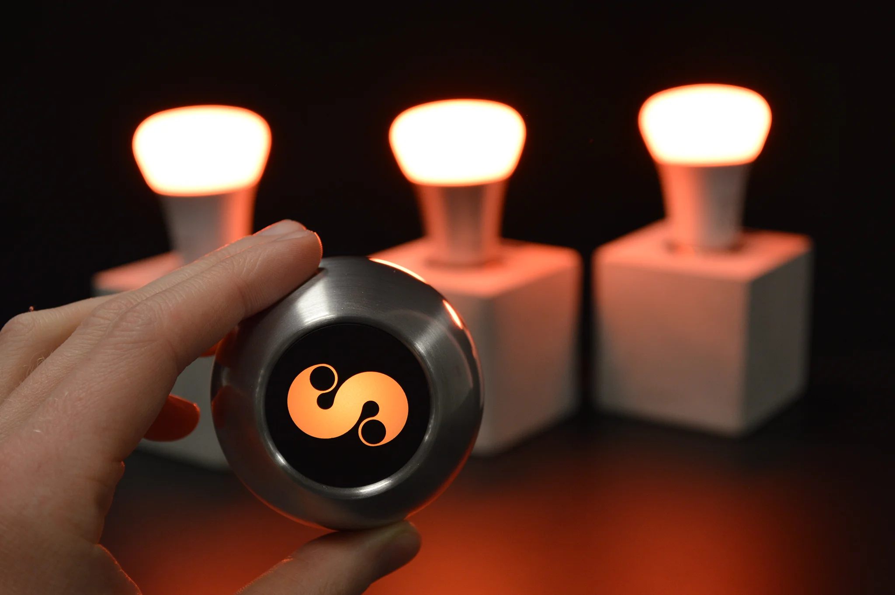
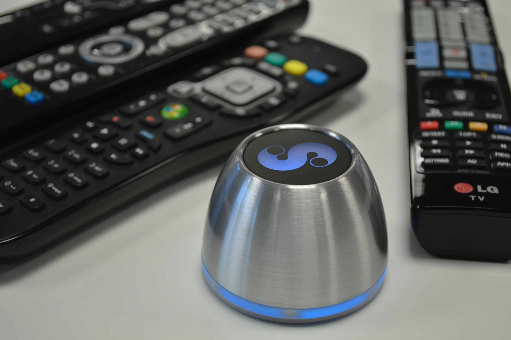
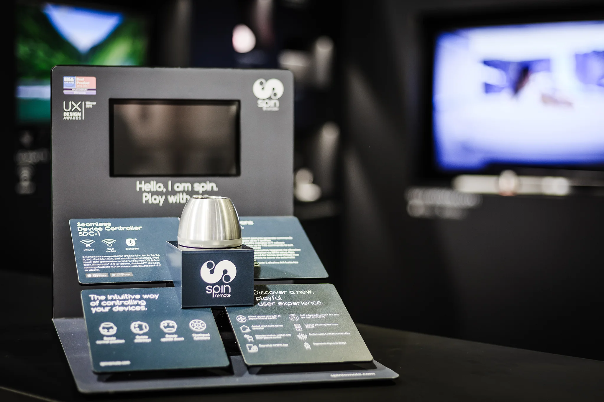

# SPIN remote

Van concept tot internationale productintroductie droeg Xtracked bij aan de ontwikkeling van SPIN remote. Het resultaat
was een compacte afstandsbediening die complexe bediening terugbracht tot één intuïtieve interactie.

## Van idee naar internationaal bekroond consumentenproduct

SPIN remote begon met een eenvoudige vraag:

> *"Waarom zijn afstandsbedieningen door de jaren heen steeds ingewikkelder geworden?"*

Steeds meer apparaten, steeds meer knoppen en steeds meer verschillende manieren van bedienen maakten het gebruik van
consumentenelektronica onnodig complex. Het doel was daarom niet om nóg een afstandsbediening te ontwikkelen, maar om
het bedieningsconcept volledig opnieuw te ontwerpen.

<figure markdown="span">

<figcaption>SPIN remote bedient Philips Hue-verlichting via een intuïtieve draai- en aanraakinterface</figcaption>
</figure>

## Het vraagstuk

De uitdaging was om één intuïtieve controller te ontwikkelen waarmee zowel bestaande als moderne apparaten op een
natuurlijke manier konden worden bediend. In plaats van tientallen knoppen werd gekozen voor een nieuw interactieconcept
waarbij beweging, rotatie, oriëntatie en aanraking centraal stonden. Sensoren vertaalden deze bewegingen naar bediening
van apparaten via onder meer infrarood, Bluetooth en Wi-Fi.

Niet het apparaat stond centraal, maar de manier waarop mensen ermee omgaan.

<figure markdown="span">
{ loading=lazy }
<figcaption>SPIN remote verving tientallen knoppen door één compacte controller met natuurlijke interacties</figcaption>
</figure>

## De bijdrage van Xtracked

Vanuit Xtracked werd gedurende de volledige productontwikkeling bijgedragen aan de technische realisatie van SPIN
remote.

Gedurende het project werd bijgedragen aan onder andere:

!!! abstract ""

    Ontwerp

    - Productontwikkeling
    - Interactieontwerp en gebruikerservaring
    - Softwarearchitectuur

    Realisatie

    - Embedded softwareontwikkeling
    - Mobiele applicaties (Android en iOS)
    - Hardware-integratie

    Productie

    - Productie- en testtooling
    - Voorbereiding op productie en certificering

    Ondersteuning

    - Technische documentatie

Het project vereiste nauwe samenwerking met internationale partners op het gebied van hardwareontwikkeling, productie en
engineering. Daarmee bood het een unieke combinatie van productontwikkeling, software engineering en technisch
projectmanagement.

Er werd ervaring opgedaan met de volledige levenscyclus van een consumentenproduct: van conceptontwikkeling en
prototyping tot productie, certificering en internationale marktintroductie.

## Het resultaat

Het project groeide uit van een idee tot een internationaal geïntroduceerd consumentenproduct. Tijdens de ontwikkeling
werd SPIN remote gepresenteerd op internationale technologiebeurzen, onderscheiden met meerdere designprijzen en
opgenomen in het assortiment van diverse toonaangevende Europese retailers.

<figure markdown="span">
{ loading=lazy }
<figcaption>Presentatie van SPIN remote op IFA Berlijn 2016, de internationale introductie van het product</figcaption>
</figure>

## Belangrijke mijlpalen

**2014**

- Introductie via Kickstarter

**2015**

- Presentatie op CES in Las Vegas
- Winnaar van de UX Design Award
- Top 10 bij de Accenture Innovation Awards

**2016**

- Officiële productintroductie op IFA in Berlijn
- Uitgelicht door CNN Tech
- Winnaar van de EISA Award 2016–2017 voor *European AV Accessory*
- Internationaal verkrijgbaar via toonaangevende retailers

## Wat dit project laat zien

SPIN remote was veel meer dan de ontwikkeling van een nieuw hardwareproduct.

Het project liet zien dat innovatie niet altijd ontstaat door méér functionaliteit toe te voegen. Soms ontstaat
vooruitgang juist door bestaande aannames los te laten en terug te gaan naar de kern van het probleem.

Die manier van denken vormt nog altijd de basis van de werkwijze van Xtracked.

**Complexiteit terugbrengen tot eenvoud.**

## Interesse in een vergelijkbaar project?

Ieder project begint met het begrijpen van het vraagstuk.

Bent u benieuwd wat Xtracked voor uw project kan betekenen?

[Neem contact op :material-arrow-right:](../contact.md){ .md-button .md-button--primary }