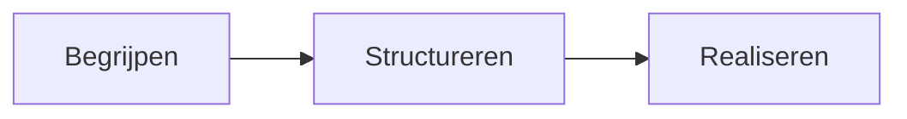

# Onze werkwijze

Deze werkwijze vormt de basis van ieder [project](./projecten/index.md) dat Xtracked uitvoert.

Niet de gekozen technologie staat daarbij centraal, maar het begrijpen van het vraagstuk, het aanbrengen van structuur
en het realiseren van een oplossing die ook op lange termijn begrijpelijk en onderhoudbaar blijft.

## Goede oplossingen beginnen niet met technologie

Vrijwel ieder technisch project begint met dezelfde vraag.

Niet:

> *"Welke software gaan we bouwen?"*

Maar:

> *"Welk probleem proberen we eigenlijk op te lossen?"*

Nieuwe software, nieuwe tooling of een nieuwe architectuur lossen zelden vanzelf een probleem op. Vaak ligt de grootste
uitdaging in de samenhang tussen processen, informatie, systemen en mensen.

**Daarom begint ieder traject met inzicht.**

De kern van ieder project is eenvoudig:

## Begrijpen

Iedere oplossing begint met het begrijpen van de huidige situatie.

!!! abstract ""

    Stakeholders

    Processen

    Informatie

    Architectuur

    Techniek

    Afhankelijkheden

Pas wanneer de context helder is, ontstaat ruimte voor een duurzame oplossing.

## Structureren

Inzicht alleen is niet voldoende.

Door structuur aan te brengen worden complexe vraagstukken beheersbaar.

Dat gebeurt onder andere met:

!!! abstract ""

    Analyse

    Documentatie

    Modellen

    Architectuur

    Eisen

    Oplossingsrichtingen

Goede documentatie is daarbij geen sluitstuk, maar een integraal onderdeel van de oplossing.

## Realiseren

Pas daarna volgt de technische realisatie.

Afhankelijk van het vraagstuk kan dat bestaan uit:

!!! abstract ""

    Softwareontwikkeling

    API-ontwerp

    Integraties

    Automatisering

    Technisch projectmanagement

    Implementatiebegeleiding

De techniek is nooit het doel.

Techniek ondersteunt de oplossing, nooit andersom.

## Onze uitgangspunten

Deze werkwijze is gebaseerd op een aantal uitgangspunten die richting geven aan ontwerp, ontwikkeling en samenwerking.

-   :material-head-lightbulb-outline:{ .lg .middle } &nbsp; **Begrijpen vóór bouwen**

    ---

    Goede oplossingen beginnen niet met programmeren, maar met begrijpen.

-   :material-circle-outline:{ .lg .middle } &nbsp; **Eenvoud boven complexiteit**

    ---

    De beste oplossing is meestal niet degene met de meeste mogelijkheden, maar degene die het eenvoudigst blijft.

-   :material-file-tree:{ .lg .middle } &nbsp; **Structuur brengt inzicht**

    ---

    Door structuur aan te brengen ontstaat overzicht. Overzicht creëert inzicht en vormt de basis voor weloverwogen
    keuzes. Heldere documentatie, consistente architectuur en transparante besluitvorming ondersteunen dat proces.

-   :material-source-branch:{ .lg .middle } &nbsp; **Open waar mogelijk**

    ---

    Open standaarden, open source en transparante documentatie bevorderen samenwerking en maken oplossingen eenvoudiger
    te delen, onderhouden en doorontwikkelen.

-   :material-leaf:{ .lg .middle } &nbsp; **Duurzame oplossingen**

    ---

    Oplossingen moeten niet alleen vandaag werken, maar ook morgen begrijpelijk, onderhoudbaar en eenvoudig aanpasbaar
    blijven.

